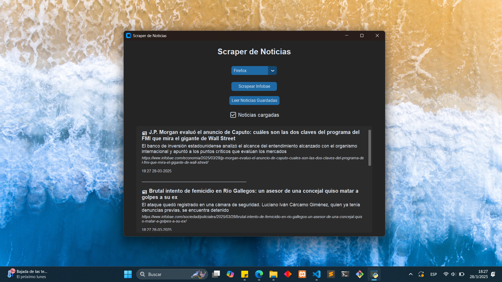

# 📰 Scraper de Noticias - Infobae

Scraper hecho en Python que extrae automáticamente las últimas noticias del sitio [Infobae](https://www.infobae.com), guarda la información en un archivo `.csv` y permite leer las noticias guardadas desde una interfaz gráfica o por consola.

Incluye:
- ✅ Interfaz gráfica moderna con [CustomTkinter](https://github.com/TomSchimansky/CustomTkinter)
- ✅ Uso desde línea de comandos (CLI)
- ✅ Soporte para múltiples navegadores (Edge y Firefox)
- ✅ Evita guardar noticias duplicadas
- ✅ Guarda título, bajada, URL y fecha/hora

---



---

## 🧪 ¿Qué noticias obtiene?

El scraper busca los enlaces más recientes del sitio Infobae que contengan `/2025/` en la URL (es decir, del año actual). Luego entra a cada una, extrae:

- 📰 Título
- 📝 Bajada (o primer párrafo)
- 🔗 URL
- 📅 Fecha y hora de scrapeo

Todo esto se guarda en `noticias.csv`, y se evita guardar noticias duplicadas.

---

## 📦 Instalación

1. Cloná el repositorio:
```bash
git clone https://github.com/TomyGauna/Web-Scraper-de-Noticias.git
cd Web-Scraper-de-Noticias
```

2. Creá y activá un entorno virtual (opcional pero recomendado):
```bash
python -m venv venv
venv\Scripts\activate  # En Windows
# o
source venv/bin/activate  # En Linux/macOS
```

3. Instalá las dependencias:
```bash
pip install -r requirements.txt
```

> Asegurate también de tener uno de estos archivos en la carpeta del proyecto:
> - `msedgedriver.exe` para usar Edge
> - `geckodriver.exe` para usar Firefox

---

## 🚀 Uso

### 🖥️ GUI (modo gráfico)
```bash
python scraper.py
```

Esto abre una ventana donde podés:
- Elegir navegador (Edge o Firefox)
- Obtener las noticias más recientes
- Leer las noticias guardadas por fecha

### 💻 CLI (modo consola)
```bash
python scraper.py --cli
```

En este modo podés:
- Elegir navegador desde un menú interactivo
- Ver en consola las noticias nuevas
- Las noticias también se guardan en `noticias.csv`

---

## 🧠 ¿Cómo funciona?

1. Abre la web de Infobae y detecta los enlaces más recientes del año.
2. Visita cada enlace, y extrae el título, la bajada y la URL.
3. Guarda todo en un archivo `noticias.csv` con la fecha y hora exacta.
4. Si una noticia ya estaba guardada (misma URL), no la vuelve a agregar.
5. Desde la GUI, podés ver las noticias guardadas por fecha.

---

## 📦 Exportar como `.exe`

Podés crear un ejecutable con `pyinstaller` si querés usarlo sin tener Python instalado:

```bash
pip install pyinstaller
pyinstaller --noconsole --onefile scraper.py
```

Esto te genera un `.exe` en la carpeta `dist/` listo para ejecutar.

---

## 💬 Autor

Desarrollado por Tomás Gauna como parte del desafío "20 Proyectos en 30 Días".  
Este desafío fue pensado para practicar Python de forma creativa y mostrarlo profesionalmente en redes.

---

## Otros proyectos

Este es el proyecto del dia uno del desafio 20 Proyectos en 30 dias:

- [Organizador de Archivos](https://github.com/TomyGauna/Organizador-Automatico-de-Archivos)

---